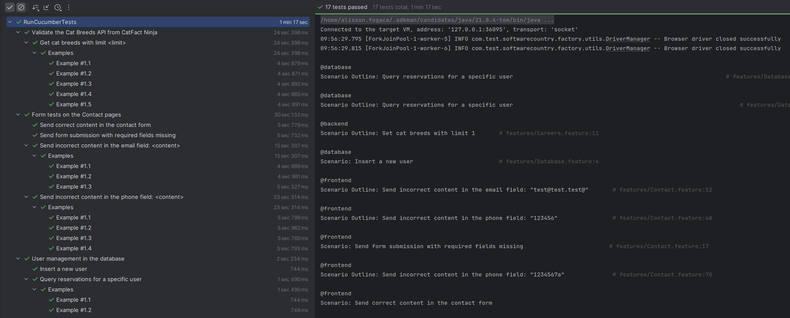
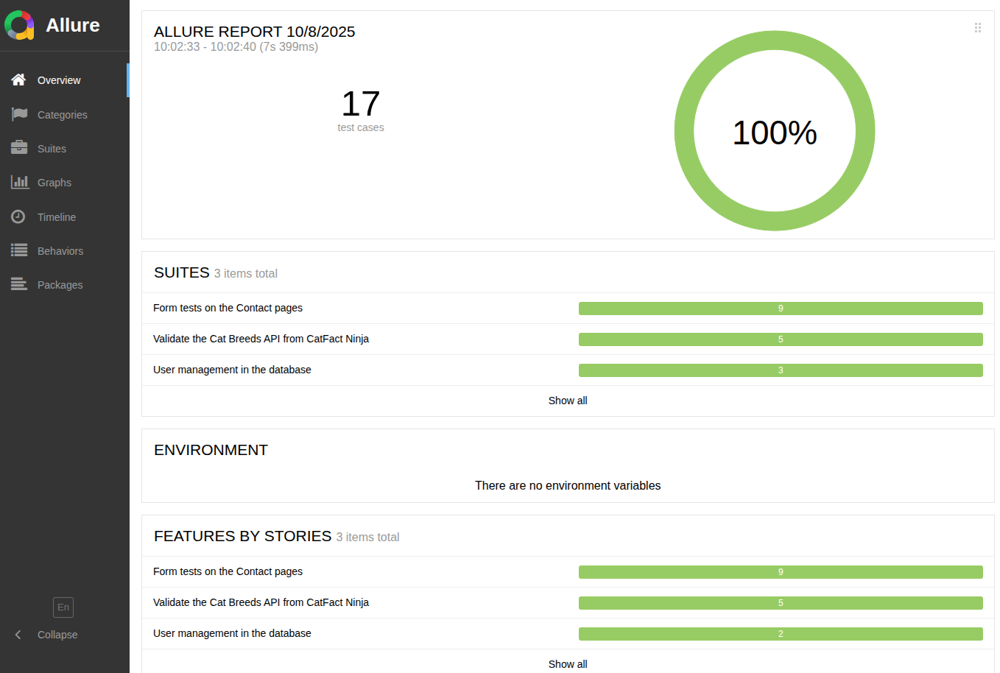
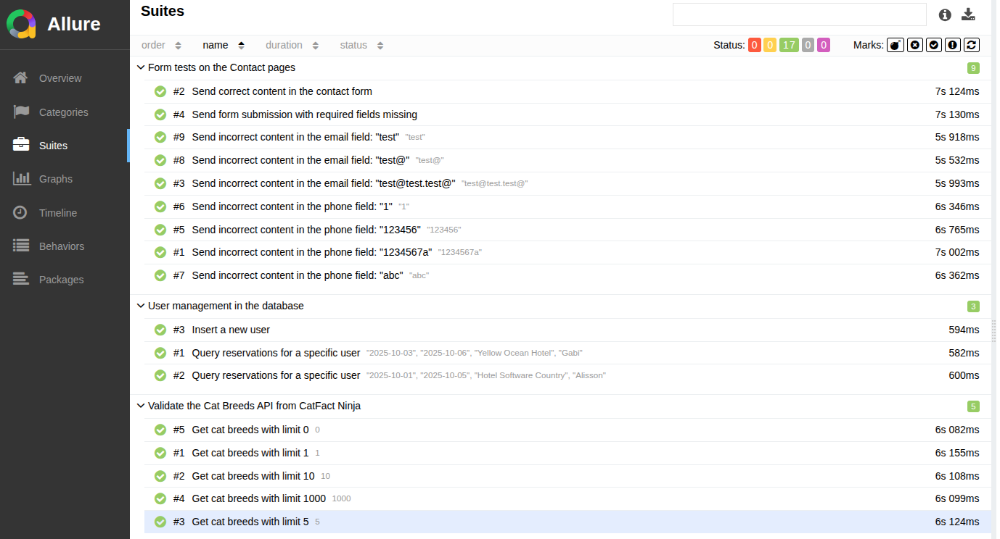

# Java Automation Testing - Software Country

This repository contains automated tests developed for the **Software Country** project using **Java**, **Selenium WebDriver**, **Rest Assured**, and **Cucumber**.

## Overview

The automation suite is designed to validate a test contact form, covering both valid and invalid inputs, and also includes a scenario to validate the response from the Cat Facts API. Additionally, the suite covers database-related scenarios, ensuring that user data can be correctly inserted and queried in the system. Currently, the test suite includes 17 automated test cases, with a scalable structure for future expansion.

## Requirements

You must have Java 21 or later installed on your machine You can download it
here: [https://www.java.com/en/download/manual.jsp](https://www.java.com/en/download/manual.jsp)

#### Dependencies

The project in Java uses some Maven dependencies already configured (you only need to do run the mvn clean install command), as follows:

- [Selenium WebDriver](https://mvnrepository.com/artifact/org.seleniumhq.selenium/selenium-java)
- [Cucumber Java](https://mvnrepository.com/artifact/io.cucumber/cucumber-java)
- [Cucumber JUnit](https://mvnrepository.com/artifact/io.cucumber/cucumber-junit)
- [Rest Assured](https://mvnrepository.com/artifact/io.rest-assured/rest-assured)
- [JUnit Jupiter API](https://mvnrepository.com/artifact/org.junit.jupiter/junit-jupiter-api)
- [H2 Database Engine](https://mvnrepository.com/artifact/com.h2database/h2)

All dependencies are managed in the `pom.xml` file.
After cloning the repository, install the required dependencies by running:

```bash
mvn clean install -DskipTests
```

## Running the Tests

To start the test runner in headless execution:

```bash
mvn clean test -Denvironment=prod
```

Alternatively, for in interactive mode:

```bash
mvn clean test -DHEADLESS=false -Denvironment=prod
```

## Generating Allure Report

After running the tests, you can generate a detailed Allure Report to visualize the test execution results.

To generate the report, run:

```bash
mvn allure:report
```

To open the generated report in your browser (if supported by your system):

```bash
mvn allure:serve
```

The report will contain an overview of all executed scenarios, status (passed/failed), steps, and more.

## Continuous Integration (CI/CD)

For automated execution in a continuous integration environment, this project is configured with GitHub Actions. The pipeline will automatically run all tests on specific events, ensuring code quality and functionality.

To view the results of the automated pipeline, navigate to the "Actions" tab in the GitHub repository.

Additionally, the Allure test report is published and accessible at:

- [https://fogaca.net/test-softwarecountry-java/](https://fogaca.net/test-softwarecountry-java/)

## Test Coverage

The following test scenarios are included:

- Submit contact form with valid data;
- Submit contact form with required fields missing;
- Submit contact form with multiple invalid email formats;
- Validate GET request to the `breeds` endpoint.
- Insert a new user into the database
- Query reservations for a specific user from the database

You can find all test cases in:

```
resources/features/
```

## Example - Automation in Action



## Example - Allure Report

 
